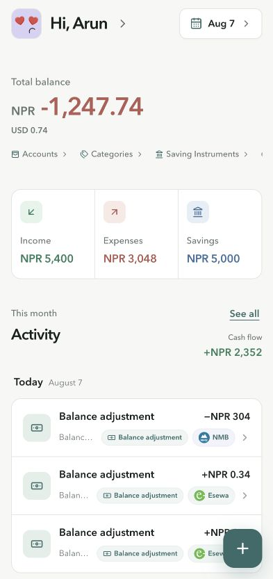
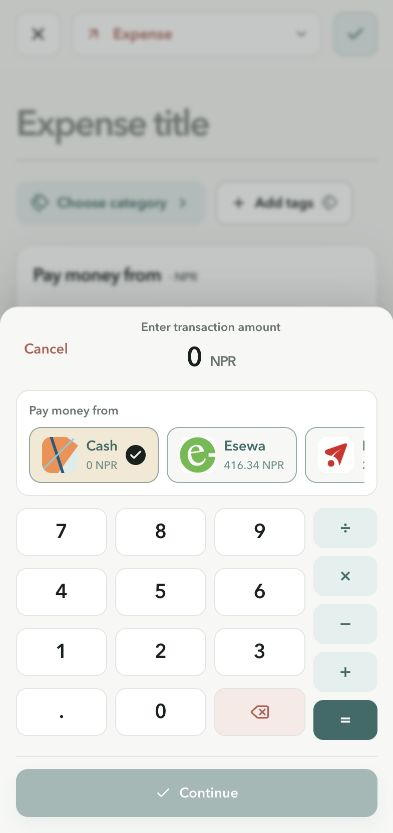
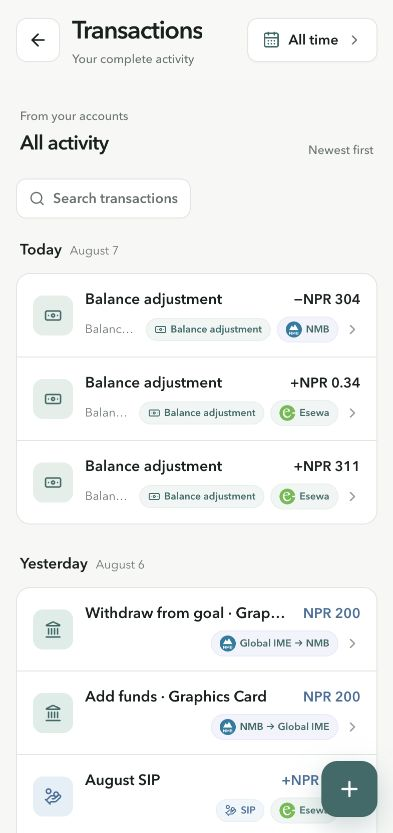
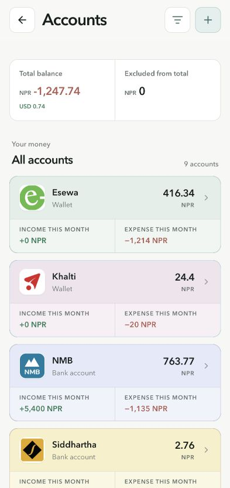
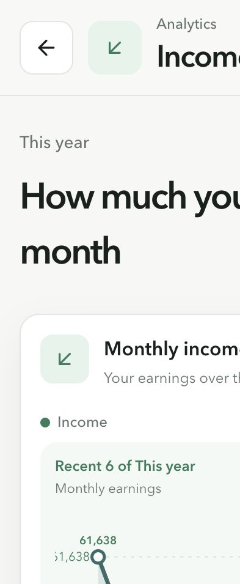
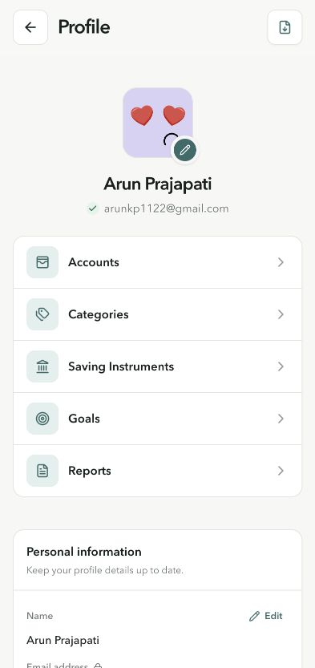

# Luna feature-gap audit

Date: 2026-08-07  
Scope: production mobile experience, representative product flows, repository routes, domain models, offline contract, and current personal-finance product patterns.

## Executive verdict

Luna already has a credible transaction-tracking foundation: accounts, categories, savings instruments, goals, analytics, reports, multi-currency balances, offline transaction entry, exports, notifications, and a polished mobile entry flow. The largest gap is not another chart. It is the planning and financial-trust layer that connects transactions to decisions.

The recommended sequence is:

1. Ship category budgets and a recurring-transactions hub using the existing backend models.
2. Add cleared/reconciled transaction state and eliminate floating-point artifacts from monetary history.
3. Add CSV import, duplicate matching, categorization rules, and stronger transaction filters.
4. Expand to debt planning, net-worth history, bill forecasting, split transactions, and receipts.

## Flow review

### 1. Dashboard — Healthy foundation, needs exceptions and action queues

The dashboard provides balance, income, expense, savings, accounts, categories, goals, and recent activity. It lacks an actionable layer such as budgets at risk, bills due, uncategorized transactions, duplicate candidates, or accounts needing reconciliation. Balance-adjustment entries expose raw floating-point values, which damages trust.

### 2. Transaction entry — Strong core flow, missing richer bookkeeping

The mobile amount editor and account selection are strong. Missing: split categories, merchant/payee, receipt capture, recurring-template creation, cleared/pending state, and duplicate warnings.

### 3. Transaction history — Usable list, weak investigation tools

The list supports search and period selection, but lacks account/category/tag/type/amount filters, saved views, bulk actions, duplicate review, reconciliation state, and a visible audit trail. Balance adjustments dominate recent activity.

### 4. Accounts — Broad account coverage, limited account intelligence

Cash, bank, wallet, credit-card, savings, investment, and loan account types are modeled. Credit-card and loan accounts do not expose statement dates, due dates, APR, minimum payments, utilization, payoff planning, or projected balances.

### 5. Analytics — Valuable summaries, inconsistent period semantics

The analytics surface has strong visual hierarchy, but the production mobile layout clips horizontally and period messaging conflicts: the card says twelve months while the chart says a recent subset of the selected year. Analytics should follow the selected period exactly and emphasize decisions, not only totals.

### 6. Profile and settings — Good control center, key product areas absent

Profile exposes accounts, categories, savings instruments, goals, reports, notifications, security, privacy, and exports. Budgets and recurring transactions are absent even though backend routes and domain models exist.

## Prioritized missing capabilities

| Priority | Capability | Why it matters | Effort |
|---|---|---|---|
| P0 | Budget planner | Converts expense history into category limits, remaining-to-spend, rollover, and overspend alerts. 
Backend budget APIs and validation already exist. | Medium |
| P0 | Recurring-transactions hub | Users need to create, review, pause, post, and track upcoming recurring items. Existing templates are not exposed in the product. | Medium |
| P0 | Reconciliation and cleared state | Lets users prove Luna matches account statements instead of relying on repeated balance adjustments. | Medium-high |
| P0 | Decimal-safe money handling | Raw values such as long binary decimals undermine financial correctness and confidence. | Medium |
| P1 | CSV import and duplicate matching | High-value onboarding and maintenance path for Nepal banks, wallets, eSewa, and Khalti; start with mapped CSV before direct bank sync. | Medium-high |
| P1 | Categorization rules | Merchant/title/account/amount rules reduce repetitive entry and improve analytics quality. | Medium |
| P1 | Transaction power tools | Add account, category, tag, type, amount, cleared-state filters; saved views; bulk recategorization; and duplicate review. | Medium |
| P1 | Debt and credit-card planner | Add statement balance, due date, APR, minimum payment, utilization, and payoff scenarios. | Medium-high |
| P1 | Bills calendar and cash-flow forecast | Combine recurring items and planned income to show upcoming obligations and projected account balances. | High |
| P2 | Split transactions | Essential for mixed-category purchases and accurate budgets. | Medium |
| P2 | Receipt capture and OCR | The transaction model already contains a receipt URL, but the live editor does not expose attachment or extraction. | Medium-high |
| P2 | Net-worth history | Show asset/liability trends across account types and currencies, not just current balances. | Medium |
| P2 | Shared household access | Optional roles, shared budgets, comments, and review workflow if Luna expands beyond solo use. | High |
| Foundation | Full offline CRUD | Offline writes currently cover transactions only; accounts, categories, goals, savings, budgets, and recurring templates remain read-only/offline-unavailable. | High |
| Foundation | Backup restore and notification inbox | Export exists; restore, delivery history, actionable failures, and an in-app alert center are still needed. | Medium |

## Recommended roadmap

### Phase 1 — Complete the budgeting loop

- Budget planner with monthly category targets, spent, remaining, rollover, and overspend states.
- Recurring hub with upcoming queue, pause/edit, approval versus automatic posting, and correct next-due-date advancement.
- Money-precision cleanup and formatted adjustment history.
- Cleared/pending status and a first reconciliation flow.

### Phase 2 — Reduce manual work

- CSV import wizard with mapping, dry run, duplicate detection, and import rollback.
- Merchant/payee field, categorization rules, and suggested categories.
- Advanced transaction filters, saved views, and bulk actions.
- Bills calendar and projected balances.

### Phase 3 — Deepen financial planning

- Debt payoff and credit-card intelligence.
- Net-worth timeline and exchange-rate handling.
- Split transactions and receipt OCR.
- Optional household collaboration and broader offline editing.

## Product principle

The home screen should evolve from a passive summary into a prioritized action queue: what is due, what is over budget, what needs categorization, what failed to sync, and which account no longer reconciles. That will make Luna feel materially more useful without making it visually busier.
