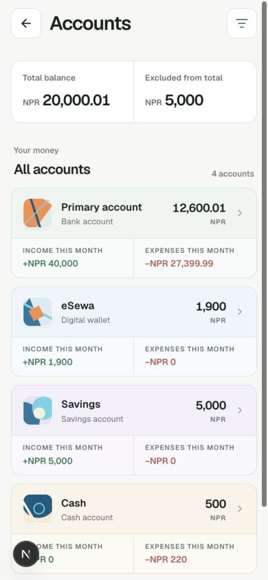
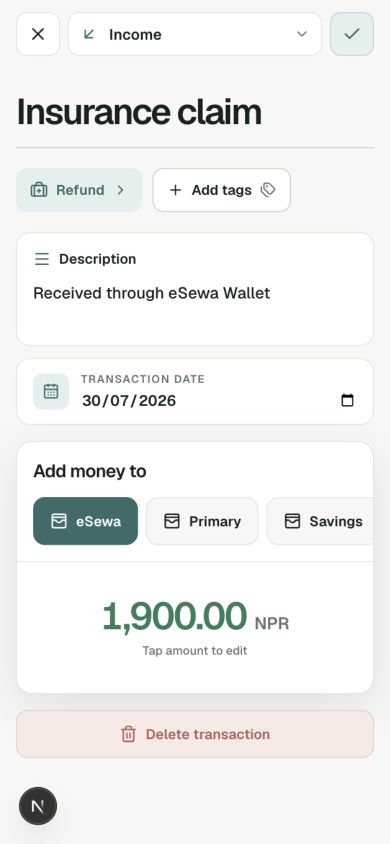
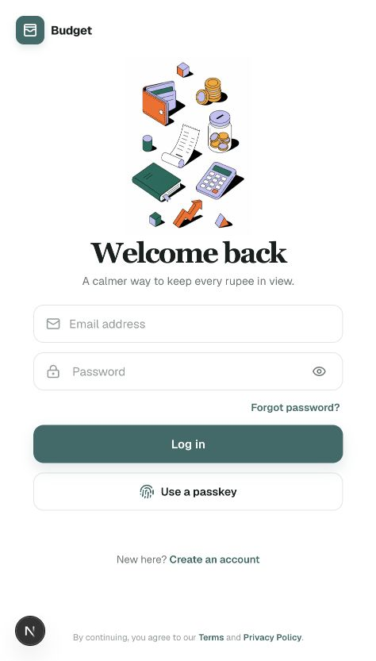
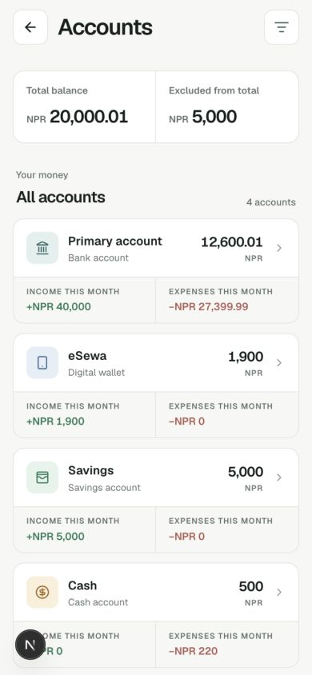

<div align="center">

# Luna

### A calmer way to manage money — online or offline.

Luna is a local-first personal finance Progressive Web App for tracking balances, cash flow, spending, and savings without losing access when the network disappears. Cloudflare D1 is the deployed SQLite source of truth.


</div>

<p align="center">
  
  
</p>

## Why Luna?

Most budgeting tools assume a reliable connection and make money management feel heavy. Luna keeps the interface focused and the important data available on the device, while synchronizing with the authenticated D1-backed API whenever the connection returns.

## Features

- **Local-first transactions** — add transactions offline, queue them locally, and sync them safely when connectivity returns.
- **Offline PWA experience** — install Luna on a phone or desktop and continue viewing the cached month and recording transactions without Wi-Fi.
- **Reliable synchronization** — queued writes use stable client IDs, remain visible when they fail, and are safe to retry without creating duplicates.
- **Home dashboard** — see total balance, monthly income, expenses, savings, cash flow, and recent activity at a glance.
- **Accounts** — manage bank accounts, cash, digital wallets, savings, credit cards, loans, and investments with custom colors and icons.
- **Transactions** — record income, expenses, savings, transfers, and balance adjustments with categories, notes, tags, dates, and recurring options.
- **Categories and tags** — use suggested categories or create your own, with custom icons and colors.
- **Savings and goals** — track savings instruments and progress toward financial goals.
- **Analytics** — explore income trends, spending by category, savings pace, and related transactions.
- **Authentication and security** — signed access tokens, rotating refresh tokens, password reset, email verification, TOTP two-factor authentication, passkeys, and optional biometric locking.
- **Privacy controls** — export personal data and request account deletion from the profile area.
- **Responsive interface** — designed for compact mobile screens first, with a comfortable desktop layout.

> Offline editing currently covers transactions. Accounts, categories, savings instruments, and profile data are cached for offline rendering and transaction composition; server-only settings still require a connection.

## Screenshots

<table>
  <tr>
    <td align="center"><strong>Sign in</strong><br /></td>
    <td align="center"><strong>Accounts</strong><br /></td>
    <td align="center"><strong>Transaction detail</strong><br /></td>
  </tr>
</table>

## Architecture

```text
Browser / installed PWA
        │
        ├── RxDB + IndexedDB
        │     └── cached data and offline transaction outbox
        │
        ├── Service worker
        │     └── app shell, offline navigation, reconnect signals
        │
        └── Next.js 16 route handlers
              ├── JWT + refresh-token authentication
              ├── Drizzle ORM
              └── Cloudflare D1 (SQLite) remote source of truth
```

The sync contract is documented in [`backend/BACKEND.md`](backend/BACKEND.md). The database schema is documented in [`SCHEMA.md`](SCHEMA.md).

## Requirements

- Node.js 20 or newer
- npm 10 or newer
- A modern browser with IndexedDB and service-worker support
- SMTP credentials are optional for password reset and email verification flows

## Getting started

From the project directory:

```bash
npm install
cp .env.example .env.local
```

Open `.env.local` and set at least:

```env
AUTH_JWT_SECRET=replace-with-a-random-secret-at-least-32-characters
APP_URL=http://localhost:3000
```

Generate a strong local secret with:

```bash
openssl rand -base64 48
```

Create the local D1 schema:

```bash
npm run db:migrate:d1:local
```

Start the development server:

```bash
npm run dev
```

Open [http://localhost:3000](http://localhost:3000).

## Production build and deployment

Build locally with:

```bash
npm run build
```

Run the Cloudflare Worker locally, including its D1 binding, with:

```bash
npm run preview
```

Pushes to `main` run [`.github/workflows/deploy.yml`](.github/workflows/deploy.yml), which applies pending D1 migrations, builds the app, and deploys the Worker. Configure the GitHub Actions secrets described in [`backend/BACKEND.md`](backend/BACKEND.md) first.

Useful checks:

```bash
npm run lint
```

After changing the D1 Drizzle schema, generate and apply a migration with:

```bash
npm run db:generate:d1
npm run db:migrate:d1:local
npm run db:migrate:d1:remote
```

The PostgreSQL schema is retained separately for local PostgreSQL tooling and migrations:

```bash
npm run db:generate
npm run db:migrate
```

## Environment variables

| Variable | Required | Purpose |
| --- | :---: | --- |
| `AUTH_JWT_SECRET` | Yes | Signs short-lived access tokens and protects encrypted auth data. |
| `APP_URL` | Recommended | Base URL used in password-reset links. |
| `SMTP_HOST` | Optional | SMTP server for password reset and verification email. |
| `SMTP_PORT` | Optional | SMTP port, usually `587`. |
| `SMTP_SECURE` | Optional | Set to `true` when the SMTP server requires TLS immediately. |
| `SMTP_USER` | Optional | SMTP username. |
| `SMTP_PASSWORD` | Optional | SMTP password or app password. |
| `SMTP_FROM` | Optional | Sender address. |
| `CRON_SECRET` | Optional | Protects the account-deletion cleanup endpoint. |
| `NEXT_PUBLIC_VAPID_PUBLIC_KEY` | Optional | Enables browser push notification subscriptions. |
| `VAPID_PUBLIC_KEY` | Optional | Server-side copy of the push public key used to send reminders. |
| `VAPID_PRIVATE_KEY` | Optional | Cloudflare Worker secret used to sign push messages. |
| `VAPID_SUBJECT` | Optional | VAPID contact or application URL. |
| `R2` Worker binding | Configured | Stores receipt and image uploads in the Cloudflare R2 `budgeyy` bucket. |

`DATABASE_URL` is only needed for the retained PostgreSQL tooling. See [`.env.example`](.env.example) for the starter configuration.

## Local-first behavior

1. Online reads populate the authenticated user's local RxDB snapshot.
2. A transaction created offline is written locally first with `syncStatus: "pending"`.
3. When connectivity returns, pending writes sync through `/api/transactions/sync`.
4. The API uses `clientGeneratedId` for idempotency, so retries do not duplicate transactions.
5. Failed writes remain visible with an error and can be retried later.

The offline database is isolated per user and never stores passwords, OTP codes, refresh tokens, or raw access tokens.

## Project structure

```text
app/                 Next.js routes, pages, and API handlers
backend/             D1/PostgreSQL schemas, auth, domain logic, and migrations
components/          UI and feature components
lib/offline/          RxDB database, sync queue, and offline types
public/               PWA manifest, service worker, and static assets
scripts/              Development and database helper scripts
```

## Deployment notes

Luna deploys as a Cloudflare Worker at `luna.arunprajapati.com` with Cloudflare D1. Keep production secrets in Worker secrets and apply D1 migrations before deploying application code.

## Status

Luna is an actively developed personal-finance PWA. The core online flows and offline transaction workflow are implemented; deeper offline editing for accounts, categories, savings instruments, and profile settings remains future work.

## License

No license has been selected yet. Until a license is added, all rights are reserved by the project owner.
